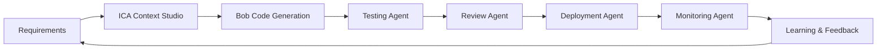

# FinTwin AI - Autonomous Financial Digital Twin

An AI-powered financial simulation platform built using **Agentic SDLC** principles with **IBM Bob** and **ICA Context Studio**.

## 🎯 Agentic SDLC Integration

This project leverages **IBM's Agentic SDLC** approach, combining:

- **Bob (IBM AI Assistant)**: Intelligent code generation, testing, and deployment automation
- **ICA Context Studio**: Enterprise-grade context management and knowledge integration
- **Multi-Agent Architecture**: Autonomous agents for development, testing, and operations

### Agentic SDLC Principles Applied:

1. **Context-Driven Development**: Using ICA Context Studio for requirements and domain knowledge
2. **AI-Assisted Code Generation**: Bob generates production-ready code following ICA patterns
3. **Autonomous Testing**: AI agents create and execute comprehensive test suites
4. **Intelligent Deployment**: Automated CI/CD with AI-driven optimization
5. **Continuous Learning**: Agents learn from feedback and improve over iterations

## 🚀 Features

- **Scenario Builder**: Create and manage economic events (interest rate changes, inflation, sector crashes, etc.)
- **Market Simulation Engine**: Simulate market reactions and sector impacts
- **Portfolio Impact Analyzer**: Analyze portfolio performance under different scenarios
- **AI Recommendation Agent**: Get intelligent insights and risk mitigation strategies
- **Multi-Step Simulation Flow**: Guided simulation execution with validation, preview, agent processing, and recovery
- **Simulation History**: Track, replay, compare, and export past simulations
- **Interactive Dashboard**: Visualize market trends, heatmaps, and risk indicators

## 🏗️ Architecture

FinTwin AI follows **ICA (IBM Consulting Advantage)** architecture principles:

### Technology Stack:

- **Frontend**: React + TypeScript with Vite
- **Backend**: Node.js + Fastify (ICA-compliant service architecture)
- **Database**: MongoDB
- **Cache**: Redis
- **AI Layer**: Multi-agent orchestration system
- **SDLC**: Bob + ICA Context Studio integration

### ICA Architecture Layers:

```
┌─────────────────────────────────────────┐
│     Presentation Layer (React)          │
├─────────────────────────────────────────┤
│     API Gateway (Fastify)               │
├─────────────────────────────────────────┤
│     Service Layer (Business Logic)      │
├─────────────────────────────────────────┤
│     AI Agent Layer (Multi-Agent)        │
├─────────────────────────────────────────┤
│     Data Layer (MongoDB + Redis)        │
└─────────────────────────────────────────┘
```

## 📋 Prerequisites

- Node.js >= 20.0.0
- npm >= 10.0.0
- MongoDB >= 6.0
- Redis >= 7.0 (optional, for caching)
- Docker & Docker Compose (optional)
- **IBM Bob CLI** (for agentic SDLC features)
- **ICA Context Studio** access (for enterprise context management)

## 🛠️ Installation

### Using npm with Agentic SDLC

1. Clone the repository:

```bash
git clone <repository-url>
cd fintwin-ai
```

2. Install dependencies:

```bash
npm install
```

3. Setup environment variables:

```bash
cp .env.example .env
# Edit .env with your configuration
# Add ICA Context Studio credentials
```

4. Initialize ICA Context Studio:

```bash
# Connect to ICA Context Studio for domain knowledge
npm run ica:init
```

5. Run the application:

```bash
npm run dev
```

### Using Docker

1. Clone the repository:

```bash
git clone <repository-url>
cd fintwin-ai
```

2. Setup environment variables:

```bash
cp .env.example .env
```

3. Start all services:

```bash
npm run docker:up
```

## 📦 Project Structure (ICA-Compliant)

```
fintwin-ai/
├── frontend/              # React TypeScript frontend
│   ├── src/
│   │   ├── components/   # Reusable UI components
│   │   ├── pages/        # Page components
│   │   ├── services/     # API services
│   │   ├── hooks/        # Custom React hooks
│   │   └── store/        # State management
│   └── package.json
├── backend/              # Node.js Fastify backend (ICA Service Layer)
│   ├── src/
│   │   ├── api/         # API routes (RESTful)
│   │   ├── services/    # Business logic (Service Layer)
│   │   ├── agents/      # AI agents (Multi-Agent System)
│   │   ├── models/      # Database models (Data Layer)
│   │   └── middleware/  # Middleware (Cross-cutting concerns)
│   └── package.json
├── tests/               # Test suites (Bob-generated)
│   ├── unit/           # Unit tests
│   ├── integration/    # Integration tests
│   └── e2e/            # End-to-end tests
├── docker/              # Docker configuration
├── .ica/                # ICA Context Studio configuration
│   ├── context/        # Domain context definitions
│   ├── patterns/       # ICA design patterns
│   └── templates/      # Code templates
├── .bob/                # Bob AI configuration
│   ├── agents/         # Bob agent definitions
│   ├── workflows/      # SDLC workflows
│   └── prompts/        # AI prompts
└── docs/                # Documentation
    ├── architecture/   # Architecture diagrams
    ├── api/            # API documentation
    └── agentic-sdlc/   # Agentic SDLC documentation
```

## 🤖 Agentic SDLC Workflow

### Development Agents:

1. **Code Generation Agent (Bob)**: Generates ICA-compliant code
2. **Testing Agent**: Creates and executes test suites
3. **Review Agent**: Performs code quality checks
4. **Documentation Agent**: Generates technical documentation

### Workflow:



## 🧪 Testing (AI-Generated)

Run all tests:

```bash
npm test
```

Run unit tests:

```bash
npm run test:unit
```

Run integration tests:

```bash
npm run test:integration
```

Run E2E tests:

```bash
npm run test:e2e
```

Generate new tests with Bob:

```bash
npm run bob:generate-tests
```

## 🚢 Deployment (Agentic)

### Build for production:

```bash
npm run build
```

### Deploy with Bob automation:

```bash
npm run bob:deploy
```

### Using Docker:

```bash
npm run docker:build
docker-compose -f docker-compose.prod.yml up -d
```

## 📚 API Documentation

Once the backend is running, access the Swagger documentation at:

```
http://localhost:3000/api/docs
```

## 👥 User Roles

1. **Financial Analyst**: Create scenarios and analyze market impacts
2. **Risk Manager**: Monitor risk metrics and get mitigation strategies
3. **Portfolio Manager**: Manage portfolios and analyze investment impacts
4. **Admin**: System administration and user management

## 🤖 AI Agents (Multi-Agent System)

### Application Agents:

- **Market Agent**: Analyzes market reactions to economic events
- **Risk Agent**: Calculates risk scores and propagation
- **Recommendation Agent**: Generates actionable insights
- **Report Agent**: Compiles comprehensive reports

### SDLC Agents (Bob):

- **Code Generation Agent**: Generates ICA-compliant code
- **Testing Agent**: Creates comprehensive test suites
- **Deployment Agent**: Automates deployment pipeline
- **Monitoring Agent**: Tracks system health and performance

## 🔒 Security (ICA Standards)

- JWT-based authentication
- Role-based access control (RBAC)
- Rate limiting
- Input validation
- Secure password hashing (bcrypt)
- ICA security patterns compliance

## 📈 Performance

- Redis caching for frequently accessed data
- Database indexing for optimized queries
- Lazy loading and code splitting in frontend
- Background job processing for simulations
- ICA performance optimization patterns

## 🎓 ICA Context Studio Integration

### Context Management:

- **Domain Context**: Financial domain knowledge and terminology
- **Business Context**: Market simulation rules and constraints
- **Technical Context**: Architecture patterns and best practices
- **Regulatory Context**: Compliance and security requirements

### Benefits:

- Consistent code generation aligned with enterprise standards
- Reusable patterns and templates
- Knowledge sharing across teams
- Faster onboarding and development

## 🤝 Contributing (Agentic Workflow)

1. Fork the repository
2. Create a feature branch (`git checkout -b feature/amazing-feature`)
3. Use Bob for code generation: `npm run bob:generate`
4. Run automated tests: `npm test`
5. Commit your changes (`git commit -m 'Add amazing feature'`)
6. Push to the branch (`git push origin feature/amazing-feature`)
7. Open a Pull Request (Bob will auto-review)

## 📝 License

This project is licensed under the MIT License - see the LICENSE file for details.

## 📧 Contact

For questions or support, please contact: support@fintwin-ai.com

## 🙏 Acknowledgments

- **IBM Bob**: AI-powered development assistant
- **ICA Context Studio**: Enterprise context management
- **ICA Architecture Principles**: Best practices and patterns
- Open source community
- Financial modeling best practices

---

**Built with Agentic SDLC** 🤖 | **Powered by IBM Bob & ICA Context Studio** 🚀
