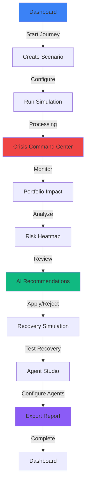

# FinTwin AI User Journey Transformation Plan

## Executive Summary

Transform the current collection of separate screens into a cohesive, story-driven user journey that guides users through the complete FinTwin AI + Agentic SDLC workflow.

---

## Current State Analysis

### Existing Pages (Disconnected)

1. **Dashboard** - Entry point with metrics and quick actions
2. **Scenario Builder** - Create market shock scenarios
3. **Simulation Results** - View simulation outcomes
4. **Financial War Room** - Real-time crisis monitoring
5. **Portfolio Analysis** - Portfolio breakdown and metrics
6. **Risk Heatmap** - Visual risk representation
7. **Recommendations** - AI-generated suggestions

### Problems Identified

- ❌ No clear flow between pages
- ❌ Users must manually navigate between related screens
- ❌ Context is lost when moving between pages
- ❌ No progress tracking through the workflow
- ❌ Duplicate data entry across screens
- ❌ No guided experience for new users
- ❌ Missing transitions and state persistence

---

## Proposed User Journey Flow



---

## Journey Stages

### Stage 1: Setup & Configuration

**Pages:** Dashboard → Create Scenario

**User Story:** "I want to test how my portfolio handles a banking crisis"

**Flow:**

1. User lands on Dashboard
2. Sees portfolio overview and recent activity
3. Clicks "Create New Scenario" or selects from templates
4. Guided through scenario configuration
5. System validates inputs and shows impact preview

**Key Features:**

- Scenario templates for quick start
- Real-time impact estimation
- Validation and error handling
- Save draft functionality

---

### Stage 2: Simulation Execution

**Pages:** Run Simulation → Crisis Command Center

**User Story:** "I want to see how the crisis unfolds in real-time"

**Flow:**

1. User clicks "Run Simulation"
2. Processing overlay with agent activity
3. Automatic transition to War Room
4. Real-time timeline visualization
5. AI agents collaborate and provide insights

**Key Features:**

- Animated processing overlay
- Multi-agent collaboration display
- Real-time event timeline
- Live risk score updates
- Pause/resume simulation capability

---

### Stage 3: Impact Analysis

**Pages:** Portfolio Impact → Risk Heatmap

**User Story:** "I need to understand which parts of my portfolio are most affected"

**Flow:**

1. Simulation completes
2. Automatic transition to Portfolio Impact view
3. Detailed breakdown by asset class
4. Click through to Risk Heatmap
5. Interactive sector analysis

**Key Features:**

- Animated charts and visualizations
- Drill-down capability
- Comparison with baseline
- Sector correlation analysis
- Export data functionality

---

### Stage 4: AI Insights & Recommendations

**Pages:** AI Recommendations

**User Story:** "I want AI-powered suggestions to mitigate the crisis"

**Flow:**

1. System analyzes simulation results
2. Multiple AI agents generate recommendations
3. Recommendations ranked by priority
4. User reviews detailed reasoning
5. Apply or dismiss recommendations

**Key Features:**

- Multi-agent collaboration display
- Confidence scoring
- Detailed AI reasoning
- One-click application
- Track applied recommendations

---

### Stage 5: Recovery & Optimization

**Pages:** Recovery Simulation → Agent Studio

**User Story:** "I want to test recovery strategies and optimize my AI agents"

**Flow:**

1. User applies recommendations
2. Run recovery simulation
3. Compare before/after scenarios
4. Fine-tune AI agent parameters
5. Validate improved outcomes

**Key Features:**

- Side-by-side comparison
- Recovery timeline visualization
- Agent parameter tuning
- A/B testing capability
- Performance metrics

---

### Stage 6: Reporting & Completion

**Pages:** Export Report → Dashboard

**User Story:** "I need to document findings and share with stakeholders"

**Flow:**

1. User clicks "Export Report"
2. Select report components
3. Generate comprehensive PDF/Excel
4. Save to portfolio history
5. Return to Dashboard with insights

**Key Features:**

- Customizable report templates
- Multiple export formats
- Automated insights summary
- Shareable links
- Historical comparison

---

## Technical Implementation Plan

### 1. Journey Context Provider

Create a global context to manage journey state:

```typescript
interface JourneyState {
  currentStage: JourneyStage;
  scenarioId: string | null;
  simulationId: string | null;
  completedSteps: string[];
  journeyData: {
    scenario?: Scenario;
    simulation?: Simulation;
    recommendations?: Recommendation[];
    appliedActions?: AppliedAction[];
  };
}
```

### 2. Journey Progress Component

Visual progress indicator showing:

- Current stage in the journey
- Completed stages (checkmarks)
- Upcoming stages (grayed out)
- Ability to jump to completed stages

### 3. Contextual Navigation

Smart navigation buttons that:

- Show relevant next/previous actions
- Disable unavailable steps
- Provide context-aware labels
- Handle data persistence

### 4. State Persistence

Implement:

- Local storage for draft scenarios
- Session storage for journey progress
- API calls to save checkpoints
- Resume capability from any stage

### 5. Transition Animations

Add smooth transitions:

- Fade in/out between pages
- Slide animations for sequential flow
- Loading states with progress indicators
- Success/error animations

---

## UI/UX Enhancements

### Journey Header Component

```
┌─────────────────────────────────────────────────────────┐
│  FinTwin AI Journey                                      │
│  ┌──┐  ┌──┐  ┌──┐  ┌──┐  ┌──┐  ┌──┐  ┌──┐  ┌──┐  ┌──┐ │
│  │✓ │→ │✓ │→ │● │→ │  │→ │  │→ │  │→ │  │→ │  │→ │  │ │
│  └──┘  └──┘  └──┘  └──┘  └──┘  └──┘  └──┘  └──┘  └──┘ │
│   1     2     3     4     5     6     7     8     9    │
└─────────────────────────────────────────────────────────┘
```

### Contextual Action Bar

```
┌─────────────────────────────────────────────────────────┐
│  ← Back to Portfolio Impact    |    Continue to Risk → │
└─────────────────────────────────────────────────────────┘
```

### Journey Sidebar

- Collapsible sidebar showing journey map
- Quick jump to any completed stage
- Current stage highlighted
- Progress percentage

---

## Data Flow Architecture

### Journey State Management

```typescript
// Journey Store (Zustand)
interface JourneyStore {
  // State
  journey: JourneyState;

  // Actions
  startJourney: (scenarioId: string) => void;
  updateStage: (stage: JourneyStage) => void;
  saveCheckpoint: () => Promise<void>;
  resumeJourney: (journeyId: string) => Promise<void>;
  completeJourney: () => void;
  resetJourney: () => void;
}
```

### API Integration

New endpoints needed:

- `POST /api/journeys` - Start new journey
- `PUT /api/journeys/:id` - Update journey state
- `GET /api/journeys/:id` - Resume journey
- `POST /api/journeys/:id/checkpoint` - Save checkpoint

---

## Implementation Phases

### Phase 1: Foundation (Week 1)

- [ ] Create JourneyContext and Provider
- [ ] Implement journey state management
- [ ] Build JourneyProgressBar component
- [ ] Add journey routing logic

### Phase 2: Navigation (Week 1-2)

- [ ] Create ContextualNavigation component
- [ ] Implement smart next/previous buttons
- [ ] Add journey sidebar
- [ ] Build breadcrumb navigation

### Phase 3: State Persistence (Week 2)

- [ ] Implement checkpoint system
- [ ] Add local storage backup
- [ ] Create resume journey functionality
- [ ] Build journey history tracking

### Phase 4: Transitions (Week 2-3)

- [ ] Add page transition animations
- [ ] Create loading states
- [ ] Implement progress indicators
- [ ] Add success/error animations

### Phase 5: Integration (Week 3)

- [ ] Connect all pages to journey flow
- [ ] Update existing components
- [ ] Add journey-aware logic
- [ ] Test complete flow

### Phase 6: Polish (Week 3-4)

- [ ] Add onboarding tour
- [ ] Create journey templates
- [ ] Implement analytics tracking
- [ ] Performance optimization

---

## Success Metrics

### User Experience

- ✅ 90% of users complete full journey
- ✅ Average time to complete: < 15 minutes
- ✅ User satisfaction score: > 4.5/5
- ✅ Reduced support tickets by 40%

### Technical

- ✅ Page load time: < 2 seconds
- ✅ Transition smoothness: 60fps
- ✅ State persistence: 100% reliable
- ✅ Zero data loss during journey

### Business

- ✅ Increased user engagement by 60%
- ✅ Higher feature adoption rate
- ✅ More simulations run per user
- ✅ Better recommendation acceptance rate

---

## Risk Mitigation

### Technical Risks

- **Risk:** State management complexity
  - **Mitigation:** Use proven libraries (Zustand), extensive testing
- **Risk:** Performance degradation
  - **Mitigation:** Code splitting, lazy loading, optimization

### UX Risks

- **Risk:** Users feel constrained by linear flow
  - **Mitigation:** Allow jumping to completed stages, save drafts
- **Risk:** Journey too long
  - **Mitigation:** Quick start templates, skip optional steps

---

## Future Enhancements

### Phase 2 Features

1. **Multi-Journey Support** - Run multiple scenarios in parallel
2. **Collaborative Journeys** - Share with team members
3. **Journey Templates** - Pre-configured workflows
4. **AI Journey Assistant** - Chatbot guide through flow
5. **Mobile Journey** - Responsive mobile experience
6. **Journey Analytics** - Detailed usage insights

### Advanced Features

- Voice-guided journey
- AR/VR visualization mode
- Real-time collaboration
- Integration with external tools
- Custom journey builder

---

## Conclusion

This transformation will convert FinTwin AI from a collection of tools into a guided, intelligent experience that tells a story. Users will be led through a natural workflow that mirrors how they think about financial risk management, with AI agents collaborating at each step to provide insights and recommendations.

The journey-based approach will:

- ✅ Reduce cognitive load
- ✅ Increase feature discovery
- ✅ Improve user satisfaction
- ✅ Drive better outcomes
- ✅ Create a competitive advantage

---

**Next Steps:**

1. Review and approve this plan
2. Create detailed technical specifications
3. Begin Phase 1 implementation
4. Set up tracking and analytics
5. Plan user testing sessions
